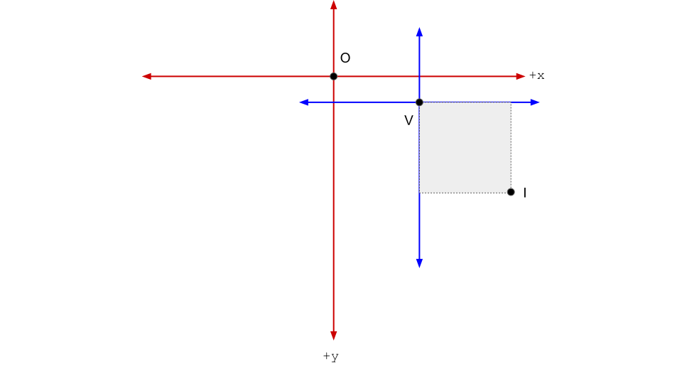

# Coordinate Systems

Neuroimaging datasets typically use multiple coordinate systems. Here, we enumerate and explain two coordinate systems used in the NeuroDataManager, describe typical use cases, and hope to justify our choice in building NeuroDataManager around these two coordinate systems.

## Voxel Coordinates vs Image Coordinates

**Voxel coordinates** relate the images in the dataset to the size of the imaged sample and its location in the specimen. By associating the voxel coordinates of a dataset with a measure of resolution for each dimension, we can easily convert from voxel space to physical units (typically microns, nanometers, etc) and back. While NeuroDataManager uses voxel coordinates, the [Neuroglancer](https://github.com/google/neuroglancer) manifest contains the voxel resolution for each dimension of a given dataset. Neuroglancer then translates the voxel coordinates to physical coordinates, allowing multiple datasets from different sources to be displayed in the same coordinate space. 

**Image coordinates** describe the size of the bounding box that contains all of the images from the imaged sample. By definition, image coordinates originate at `(0,0,0)`. Typically, this is the upper left corner of the bottom slice of the imaging sample. NeuroDataManager is agnostic to the location of the origin as long as all axis are non-negative. However, we recommend sticking with the neuroimaging convention when interfacing with Data Manager -- it will make interfacing with other community tools much easier! 




In the preceding figure, the red axis represent voxel coordinates while the blue axis represent image coordinates. The origin of the voxel coordinate system is **O** (always defined to be `(0,0,0)` in NeuroDataManager). The origin of the image coordinate system is **V**. In NeuroDataManager, we refer to **V** as the `voxel_offset`. The extent of the image coordinate system is **I**, referred to as the `image_size` in NeuroDataManager. Given **V** and **I**, we can translate provided coordinates from voxel coordinates to image coordinates, or vice versa.

## NeuroDataManager Cutouts

(aka *Why do I care?*)

NeuroDataManager supports both coordinate systems when specifying the dimensions of a cutout for either a `Get` (`-output`) or `Put` (`-input`) request. When ingesting data (`Put` requests), it is sometimes easier to operate in image space, rather than attempting to translate the coordinates of a tile/chunk of data into voxel space. Conversely, when getting a cutout, it is often desirable to use voxel coordinates to preserve information about where the cutout is located within the specimen (not just within the imaged sample). 

### NDM API (v0.2, v0.3)

NDM currently provides the following flag to allow the user to specify either voxel coordinates or image coordinates:
```
-subtractVoxelOffset (If false, provided coordinates do not include the
      global voxel offset of the dataset (e.g. are 0-indexed with respect to
      the data on disk). If true, the voxel offset is subtracted from the
      cutout arguments in a pre-processing step.) type: bool default: false
```

If `subtractVoxelOffset` is false, the cutout coordinates are expected to be in **image space**. Otherwise, the cutout coordinates are expected to be in **voxel space**. During a `Get` / `Put` operation, NeuroDataManager converts all coordinates to image space -- thus, by default `subtractVoxelOffset` is false and the cutout coordinates are expected to be in **image space**.

### NDM API (future)
We are planning to transition the current NeuroDataManager API to simply allow the user to specify the coordinate system using the following flag:
```
-coordinates (Specify the coordinate system in which the provided cutout bounding box lives. Options are 'image' or 'voxel'.) type: string default: image
```

Feedback in Github (See [Issue #11](https://github.com/neurodata/DataManager/issues/11)) is most welcome.

## Example Usage

NeuroDataManager allows the user to specify a series of offsets as part of the cutout arguments. Note that the offsets default to `0`. Therefore, if you pass in the `subtractVoxelOffset` flag, you must also specify an offset for `x` and `y` if the voxel offset of the dataset is other than `0` (if the voxel offset for a dimension is `0`, then the image coordinate space and voxel coordinate space are the same for that dimension).

For example, suppose the point **V** in the figure above is located at `(256,512,0)` and the point **I** is located at `(768,1024,0)`.


If we wish to put a single slice of the dataset using `ndm`, we could easily use image coordinates:
```
bin/ndm -datadir data_dir_path/ -input test_input_slice.tif -x 512 -y 512 -z 1
```

Now suppose the voxel resolution of the dataset is `1 nm per voxel` and we wish to access a `256 nm^2` sample starting from `(400, 600, 0)`. We could use the following cutout request, now in voxel coordinates:
```
bin/ndm -datadir data_dir_path/ -output test_output_slice.tif -x 256 -xoffset 400 -y 256 -yoffset 600 -z 1 -zoffset 0 -subtractVoxelOffset
```

Note that NeuroDataManager cutout data is always 0-indexed with respect to the supplied offsets (i.e. the cutout request above would return a `256 by 256 by 1` matrix containing the requested data). 
